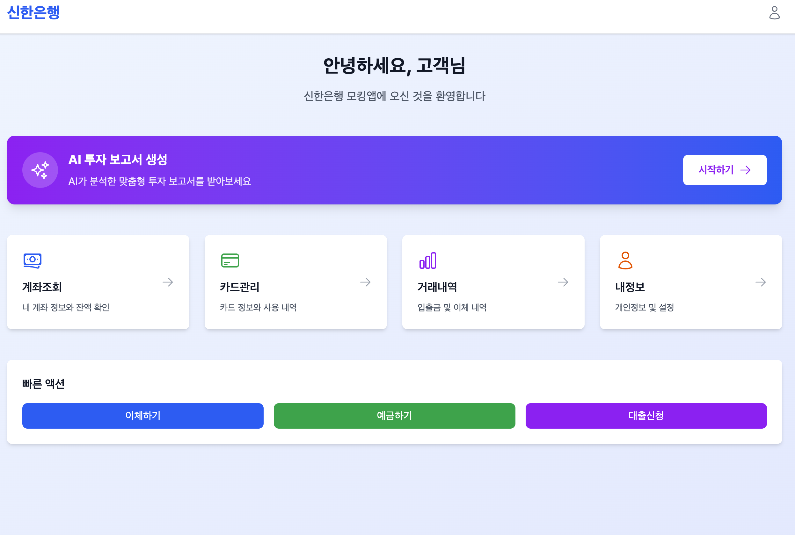
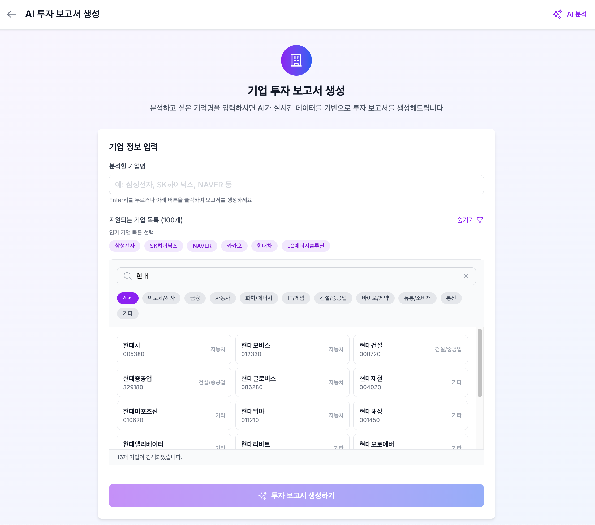
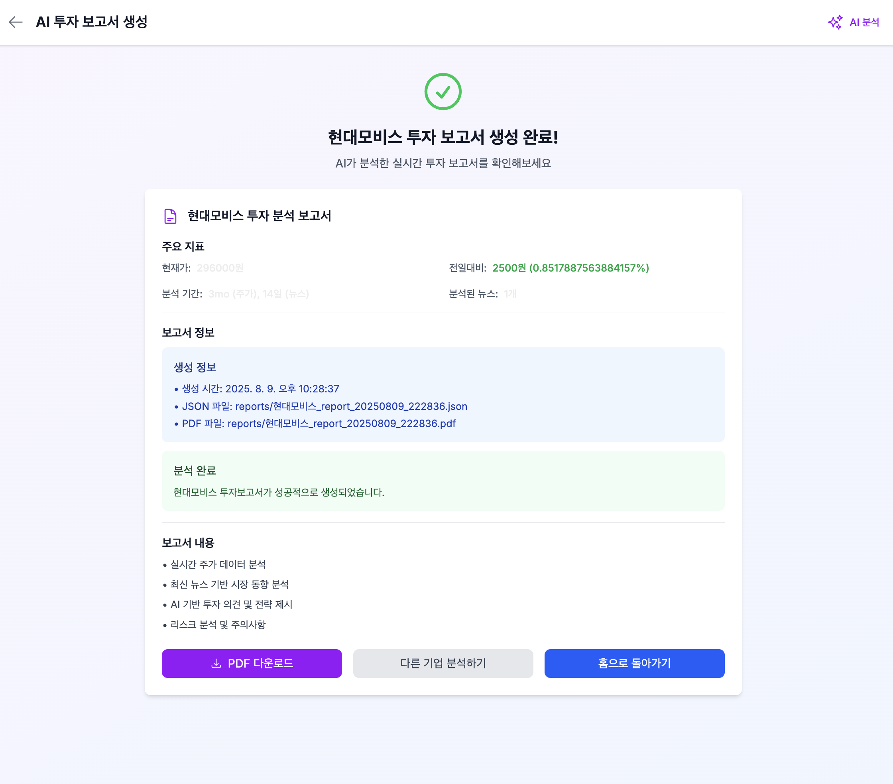

# 🏦 신한 개인프로젝트: AI 투자보고서 생성 시스템

> 실시간 주가 데이터와 뉴스 분석을 통한 AI 기반 투자보고서 자동 생성 플랫폼

## 🎯 프로젝트 목표

한국 주식 시장 분석을 통해 개인 투자자들이 더 나은 투자 결정을 내릴 수 있도록 돕는 것입니다.

## 📋 프로젝트 개요

한국 주식 시장의 실시간 데이터와 최신 뉴스를 분석하여 GPT-4 기반의 전문적인 투자보고서를 자동 생성하는 풀스택 웹 애플리케이션입니다. 웹 기반으로 사용자 친화적인 인터페이스를 제공합니다.

## 🎯 주요 기능

### 1. 실시간 주가 분석

- 현재가, 전일대비 변화율, 거래량 등 기본 정보
- 52주 최고가/최저가, 시가총액, PER 등 상세 지표
- 5일, 20일 이동평균선과의 관계 분석
- 지지/저항선 수준 분석

### 2. 기술적 분석

- 단기/중기/장기 추세 분석
- 변동성 수준 및 추세 강도 계산
- 거래량 패턴 분석
- 52주 기준 현재 가격 위치 분석

### 3. 뉴스 기반 분석

- 최신 뉴스 수집 및 분석
- 뉴스가 주가에 미치는 영향 평가
- 시장 심리 및 모멘텀 분석

### 4. AI 투자보고서 생성

- GPT-4 기반 전문적인 투자 의견
- 매수/매도/보유 추천 및 근거
- 위험 요소 및 주의사항
- 목표가 및 시나리오 분석

### 5. 동적 분석 기간 조정

- 변동성에 따른 분석 기간 자동 최적화
- 높은 변동성: 2개월 주가, 10일 뉴스
- 중간 변동성: 1개월 주가, 7일 뉴스
- 낮은 변동성: 3개월 주가, 14일 뉴스

### 6. PDF 보고서 생성

- 전문적인 레이아웃의 PDF 보고서
- 주가 차트 및 기술적 지표 시각화
- 미래 주가 예측 차트 포함
- 한글 폰트 지원

## 📱 주요 화면 미리보기

### 홈페이지



### 보고서 생성 페이지



### 보고서 생성 완료 페이지



### PDF 보고서 예시

실제 생성된 현대모비스 투자보고서 PDF 파일:

📄 [현대모비스 투자보고서 PDF 예시](reports/현대모비스_report_20250809_222836.pdf)

## 📊 지원 종목

현재 다음 한국 주요 기업들을 지원합니다:

| 기업명           | 티커      | 업종       |
| ---------------- | --------- | ---------- |
| 삼성전자         | 005930.KS | 기술주     |
| SK하이닉스       | 000660.KS | 기술주     |
| LG에너지솔루션   | 373220.KS | 배터리     |
| NAVER            | 035420.KS | 기술주     |
| 카카오           | 035720.KS | 기술주     |
| LG화학           | 051910.KS | 화학       |
| 현대차           | 005380.KS | 자동차     |
| 기아             | 000270.KS | 자동차     |
| POSCO홀딩스      | 005490.KS | 철강       |
| KB금융           | 105560.KS | 금융       |
| 신한지주         | 055550.KS | 금융       |
| LG전자           | 066570.KS | 전자       |
| 삼성바이오로직스 | 207940.KS | 바이오     |
| 현대모비스       | 012330.KS | 자동차부품 |
| 셀트리온         | 068270.KS | 바이오     |
| SK텔레콤         | 017670.KS | 통신       |
| KT&G             | 033780.KS | 담배       |
| 한국전력         | 015760.KS | 전력       |
| 삼성물산         | 028260.KS | 건설       |
| LG디스플레이     | 034220.KS | 디스플레이 |

### 🎯 주요 특징

- ✅ **실시간 데이터 분석**: Yahoo Finance API를 통한 실시간 주가 정보
- ✅ **AI 기반 분석**: OpenAI GPT-4를 활용한 전문적인 투자 의견 생성
- ✅ **뉴스 통합 분석**: NewsAPI를 통한 최신 뉴스 기반 시장 동향 분석
- ✅ **동적 기간 조정**: 변동성에 따른 분석 기간 자동 최적화
- ✅ **PDF 보고서**: 차트와 분석이 포함된 전문적인 PDF 보고서 생성
- ✅ **웹 인터페이스**: Next.js 기반의 현대적이고 직관적인 사용자 인터페이스
- ✅ **실시간 진행 상황**: 분석 진행 상황 실시간 표시

## 🛠️ 기술 스택

### 백엔드

- **Python 3.8+**
- **Flask 3.0.0** - RESTful API 서버
- **Flask-CORS 4.0.0** - CORS 처리
- **OpenAI API** - GPT-4 기반 AI 분석
- **yfinance 0.2.65+** - 실시간 주가 데이터
- **NewsAPI** - 뉴스 데이터 수집
- **ReportLab 4.0.9** - PDF 보고서 생성
- **Matplotlib 3.8.2** - 주가 차트 생성
- **Pandas 2.2.2** - 데이터 처리 및 분석
- **NumPy 1.26.4** - 수치 계산

### 프론트엔드

- **Next.js 15.4.5** - React 기반 프론트엔드 프레임워크
- **React 19.1.0** - 사용자 인터페이스 라이브러리
- **TypeScript 5** - 타입 안전성
- **Tailwind CSS 4** - 유틸리티 기반 CSS 프레임워크
- **Heroicons** - 아이콘 라이브러리

### 데이터 소스

- **Yahoo Finance** - 실시간 주가 데이터
- **NewsAPI** - 뉴스 데이터
- **OpenAI GPT-4** - AI 분석 엔진

## 🚨 주의사항 및 제한사항

### ⚠️ 투자 관련 주의사항

- **본 시스템은 투자 참고용으로만 사용하시기 바랍니다**
- **실제 투자 결정은 반드시 본인의 판단과 책임 하에 이루어져야 합니다**
- **AI 분석 결과는 시장 상황에 따라 부정확할 수 있습니다**
- **과거 데이터 기반 분석이므로 미래 수익을 보장하지 않습니다**

### 🔒 기술적 제한사항

- API 사용량 제한에 주의 (OpenAI, NewsAPI)
- 보고서 생성에 1-2분 소요
- 네트워크 연결 필요 (실시간 데이터)
- 한국 시장 거래 시간 외에는 데이터가 제한적일 수 있음

### 📋 시스템 요구사항

- 백엔드 서버가 먼저 실행되어야 함
- API 키가 올바르게 설정되어야 함
- Python 3.8+ 및 Node.js 18+ 필요

## 📁 프로젝트 구조

```
shinhan_personal_project/
├── app.py                          # Flask API 서버 (메인 백엔드)
├── requirements.txt                # Python 의존성
├── example_usage.py               # CLI 사용 예제
├── .env                          # 환경 변수 (생성 필요)
├── reports/                      # 생성된 보고서 저장
│   ├── *.json                   # JSON 형태 보고서
│   └── *.pdf                    # PDF 형태 보고서
├── src/
│   ├── analysis/
│   │   ├── analyze.py           # AI 투자보고서 생성 로직
│   │   └── outlook_generator.py # 투자 전망 생성
│   ├── fetch/
│   │   ├── stock_fetcher.py     # 주가 데이터 수집
│   │   └── news_fetcher.py      # 뉴스 데이터 수집
│   ├── report/
│   │   └── pdf_generator.py     # PDF 보고서 생성
│   └── frontend/                # Next.js 웹 애플리케이션
│       ├── package.json         # Node.js 의존성
│       ├── src/
│       │   ├── app/
│       │   │   ├── page.tsx     # 메인 페이지
│       │   │   └── ai-investment-report/
│       │   │       └── page.tsx # 투자보고서 생성 페이지
│       │   ├── lib/
│       │   │   └── utils.ts     # 유틸리티 함수
│       │   └── types/
│       │       └── index.ts     # TypeScript 타입 정의
│       ├── tailwind.config.ts   # Tailwind 설정
│       └── tsconfig.json        # TypeScript 설정
├── FRONTEND_BACKEND_사용법.md     # 웹 시스템 사용법
├── PDF_사용법.md                 # PDF 생성 가이드
└── README.md                     # 프로젝트 문서 (현재 파일)
```

## 🚀 설치 및 설정

### 1. 사전 요구사항

- Python 3.8 이상
- Node.js 18 이상
- npm 또는 yarn

### 2. 저장소 클론

```bash
git clone https://github.com/jihorobert/shinhan_personal_project.git
cd shinhan_personal_project
```

### 3. 환경 변수 설정

프로젝트 루트에 `.env` 파일을 생성하고 다음 API 키들을 설정하세요:

```env
# OpenAI API 키 (필수)
GPT_KEY=your_openai_api_key_here

# NewsAPI 키 (필수)
NEWSAPI_KEY=your_newsapi_key_here
```

#### API 키 발급 방법

- **OpenAI API Key**: [OpenAI Platform](https://platform.openai.com/api-keys)에서 발급
- **NewsAPI Key**: [NewsAPI](https://newsapi.org/register)에서 무료 계정 생성 후 발급

### 4. Python 의존성 설치

```bash
# 가상환경 생성 (권장)
python -m venv venv
source venv/bin/activate  # Windows: venv\Scripts\activate

# 의존성 설치
pip install -r requirements.txt

# yfinance 관련 오류가 발생하는 경우
pip install yfinance --upgrade --no-cache-dir
```

### 5. Node.js 의존성 설치

```bash
cd src/frontend
npm install
```

## 🖥️ 실행 방법

### 웹 시스템 실행 (권장)

#### 1단계: 백엔드 API 서버 실행

프로젝트 루트 디렉토리에서:

```bash
python app.py
```

서버가 `http://localhost:5001`에서 실행됩니다.

#### 2단계: 프론트엔드 개발 서버 실행

새 터미널을 열고:

```bash
cd src/frontend
npm run dev
```

프론트엔드가 `http://localhost:3000`에서 실행됩니다.

#### 3단계: 웹 브라우저에서 사용

1. `http://localhost:3000` 접속
2. "AI 투자 보고서 생성" 클릭
3. 분석하고 싶은 기업명 입력 (예: 삼성전자, SK하이닉스 등)
4. "투자 보고서 생성하기" 버튼 클릭
5. 1-2분 후 분석 결과 확인
6. PDF 다운로드 버튼으로 보고서 다운로드

### CLI 시스템 실행 (개발자용)

```bash
# 단일 기업 분석
python example_usage.py

# 또는 직접 모듈 실행
cd src/analysis
python analyze.py
```

## 🔧 API 엔드포인트

### GET `/api/health`

서버 상태 확인

```json
{
  "status": "healthy",
  "timestamp": "2024-01-01T12:00:00"
}
```

### GET `/api/supported-companies`

지원되는 기업 목록 조회

```json
{
  "companies": [
    { "name": "삼성전자", "ticker": "005930.KS" },
    { "name": "SK하이닉스", "ticker": "000660.KS" }
  ],
  "count": 20
}
```

### POST `/api/generate-report`

투자보고서 생성

```json
// 요청
{
  "company_name": "삼성전자"
}

// 응답
{
  "success": true,
  "message": "삼성전자 투자보고서가 성공적으로 생성되었습니다.",
  "company_name": "삼성전자",
  "json_file": "reports/삼성전자_report_20240101_120000.json",
  "pdf_file": "reports/삼성전자_report_20240101_120000.pdf",
  "summary": {
    "current_price": "75000",
    "change": "+1000",
    "change_percent": "+1.35",
    "analysis_period": "1mo (주가), 7일 (뉴스)",
    "news_count": 15
  },
  "timestamp": "2024-01-01T12:00:00"
}
```

### GET `/api/download-pdf/<filename>`

PDF 파일 다운로드

## 📁 생성되는 파일

보고서는 `reports/` 디렉토리에 저장됩니다:

### JSON 보고서

```
{기업명}_report_{날짜}_{시간}.json
```

- 완전한 분석 데이터
- 주가 정보, 기술적 분석, 뉴스 데이터
- AI 생성 투자보고서 텍스트

### PDF 보고서

```
{기업명}_report_{날짜}_{시간}.pdf
```

- 전문적인 레이아웃
- 주가 차트 및 시각화
- AI 분석 결과 정리

## 🐛 문제 해결

### 자주 발생하는 오류

#### 1. "서버와 통신 중 오류가 발생했습니다"

**해결방법:**

- 백엔드 서버(`http://localhost:5001`)가 실행 중인지 확인
- 터미널에서 `python app.py` 실행
- 방화벽 설정 확인

#### 2. "지원 기업 목록을 불러올 수 없습니다"

**해결방법:**

- 백엔드 서버 연결 상태 확인
- `.env` 파일의 API 키 설정 확인
- 네트워크 연결 상태 확인

#### 3. yfinance 관련 오류

**"Failed to get ticker" 또는 "Expecting value" 오류:**

```bash
# yfinance를 최신 버전으로 업그레이드
pip install yfinance --upgrade --no-cache-dir

# 가상환경에서
source venv/bin/activate
pip install yfinance --upgrade --no-cache-dir
```

#### 4. PDF 다운로드 실패

**해결방법:**

- 브라우저의 팝업 차단 설정 확인
- `reports/` 디렉토리 권한 확인
- 디스크 공간 확인

#### 5. 한글 폰트 관련 오류

**해결방법:**

- macOS: 시스템 폰트 확인
- Windows: `malgun.ttf` 폰트 존재 확인
- Linux: `sudo apt-get install fonts-nanum` 실행

### 성능 최적화

#### 메모리 사용량 최적화

- 대량 분석 시 배치 크기 조정
- 차트 생성 후 메모리 해제 확인

#### API 사용량 최적화

- 동일 기업 연속 분석 시 캐싱 활용
- 분석 기간 적절히 조정

## 🚀 향후 개발 계획

### 단기 계획

- [ ] 더 많은 한국 기업 지원
- [ ] 실시간 알림 기능
- [ ] 포트폴리오 분석 기능
- [ ] 모바일 반응형 개선

### 중장기 계획

- [ ] 사용자 계정 시스템
- [ ] 보고서 히스토리 관리
- [ ] 커스텀 분석 지표 설정
- [ ] 다국어 지원 (영어)
- [ ] 클라우드 배포
